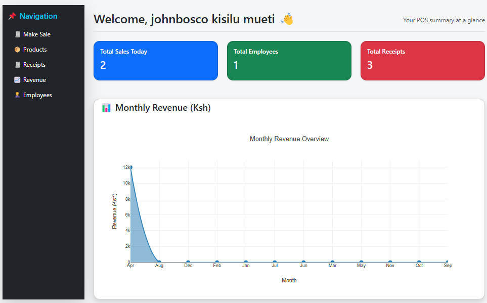
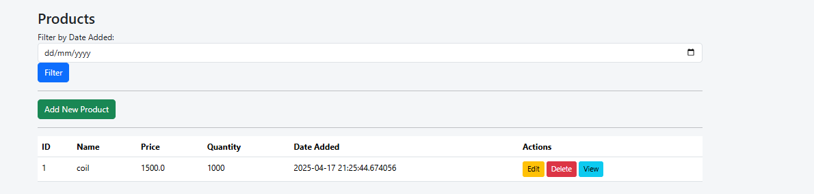
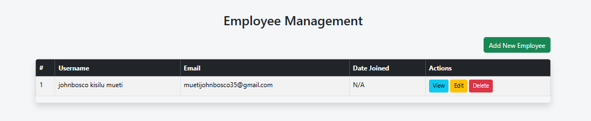

# 🛒 Python Offline POS System (Flask + SQLite)

[](LICENSE)
[](https://www.python.org/)
[](https://www.linkedin.com/in/johnboscokisilumueti/)
[](https://github.com/kisilumueti/python-offline-pos)

> An easy-to-use, offline-ready Point of Sale system built with Python, Flask, and SQLite. Designed for small businesses, shops, and cyber cafes in Kenya and beyond.

---

## 🔥 Features

✅ Fully Offline — No internet required  
✅ Cross-platform — Works on Windows (.exe available)  
✅ User Login & Role Management  
✅ Employee Management  
✅ Product & Service Management  
✅ Sales & Receipt Printing  
✅ Stock Tracking & Sales History  
✅ Monthly Revenue Tracking with Graphs  
✅ Clean Dashboard UI  
✅ Simple Setup — Runs with one click  
✅ Can be installed on multiple computers  

---

## 📸 Screenshots

### 🧾 Dashboard View  


### 📦 Product Management  


### 👨‍💼 Employee Management  


---

## 🏗️ Tech Stack

| Technology      | Usage                          |
|------------------|-------------------------------|
| **Python 3**      | Core Programming Language     |
| **Flask**         | Backend Web Framework         |
| **SQLite**        | Lightweight Local Database    |
| **Bootstrap 5**   | Frontend UI Styling           |
| **Chart.js**      | Revenue Graphs & Visualization|
| **PyInstaller**   | Windows `.exe` Packaging      |

---

## 🚀 Getting Started

### 1️⃣ Clone the Repository

```bash
git clone https://github.com/kisilumueti/python-offline-pos.git
cd python-offline-pos

2️⃣ Create a Virtual Environment
bash
Copy
Edit
python -m venv venv
venv\Scripts\activate  # On Windows
3️⃣ Install Dependencies
bash
Copy
Edit
pip install -r requirements.txt
4️⃣ Run the App
bash
Copy
Edit
python main.py
The app will open in your browser at:
📍 http://127.0.0.1:5000

🔐 Login Credentials

Role	Username	Password
Admin	admin	admin123
Cashier	cashier	cashier123
You can add/edit more users in the Admin Dashboard.

🖨️ Build Windows Executable (.exe)
Compile it into a single .exe file with all templates and static files:

bash
Copy
Edit
pyinstaller --onefile --noconsole --add-data "app\\templates;templates" --add-data "app\\static;static" main.py
✅ Output is in /dist/main.exe
✅ Can be shared and installed without Python or XAMPP
✅ Works 100% offline

📤 Download Prebuilt EXE
You can download the compiled .exe version from the Releases Section.

📦 Folder Structure
bash
Copy
Edit
pos_system/
├── app/
│   ├── __init__.py
│   ├── auth/
│   ├── sales/
│   ├── products/
│   ├── employees/
│   └── templates/
├── static/
├── docs/
│   ├── dashboard.png
│   ├── products.png
│   └── employeemanagement.png
├── main.py
├── requirements.txt
└── README.md
📈 Monthly Revenue Dashboard
Track your performance with interactive graphs:

csharp
Copy
Edit
[Jan] ████████     Ksh. 30,000  
[Feb] ██████████   Ksh. 45,000  
[Mar] ██████       Ksh. 20,000  
...
Powered by Chart.js for clarity and simplicity.

👨‍💻 Developer
Johnbosco Mueti (johnosco)

💼 LinkedIn

📧 Email: muetijohnbosco35@gmail.com

📱 WhatsApp: +254 716 005166

📸 Instagram: @techkenya_

📄 License
This project is licensed under the MIT License — free to use, modify, and distribute.

💬 Feedback & Contributions
Want to improve this system or add more features like:

SMS alerts 📲

Cloud sync ☁️

Expense tracker 📊

Multi-shop POS 🏪

Feel free to fork the project, create issues, or reach out via LinkedIn.
Let’s empower more Kenyan businesses with local tech 💻🇰🇪.

yaml
Copy
Edit

---

✅ You can paste this entire content into your `README.md`  
📁 Save all screenshots in a folder called `docs/` inside your project  
📸 Rename your local images:
- `dashboard.png`
- `products.png`
- `employeemanagement.png`

Let me know if you want an installation video, a live demo badge, or GitHub Action CI badge added.


